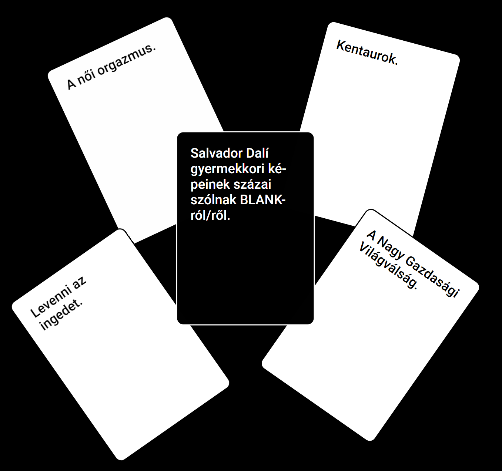

# Emberiség Ellenes Kártyák

<!-- TOC -->
* [Emberiség Ellenes Kártyák](#emberiség-ellenes-kártyák----egy-partijáték-borzalmas-embereknek)
    * [Ahogy azt a játék eredeti készítői írják](#ahogy-azt-a-játék-eredeti-készítői-írják)
<!-- TOC -->

## Ahogy azt a játék eredeti készítői írják

Az **Emberiség Ellenes Kártyák** egy olyan kitöltős partijáték, amely a kínos személyiségedet és a gyenge szociális készségeidet órákig tartó szórakozássá változtatja! Hűha!

A játék egyszerű. Minden körben az egyik játékos feltesz egy kérdést egy fekete kártyáról, és mindenki más a legviccesebb fehér kártyájával válaszol.

## Segíts naprakészen tartani a kártyákat

A játékot folyamatosan fejlesztjük, és a kártyák is változnak. Ha úgy érzed, hogy van egy jó ötleted, vagy csak szeretnél segíteni, akkor kérlek,
nyiss egy [[issue-t](https://github.com/antalmate12/hungarian-cards-against-humanity/issues)].
